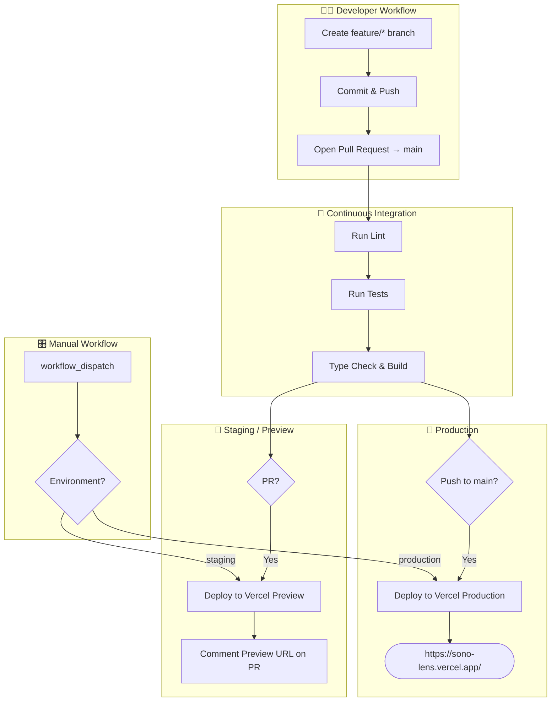

# SonoLens

Transform images into Spotify playlists using AI.

## 🚀 Overview
SonoLens is an experimental SvelteKit app that transforms **images into AI‑generated Spotify playlists**. The MVP focuses on authentication and foundation features, with a strong emphasis on clean engineering and a modern CI/CD workflow.

---

## 📌 MVP Status
The current MVP implements **Spotify Authorization Code with PKCE** flow, allowing users to:
- Authenticate with their Spotify account
- View profile information in a Neo‑Brutalism styled dashboard
- Securely manage OAuth tokens using encrypted cookies

Upcoming versions will introduce **image uploads, AI mood extraction, and automatic playlist generation**.

---

## 🧩 Prerequisites

### 1. Spotify Developer App
Create an app at the Spotify Developer Dashboard:
1. Go to https://developer.spotify.com/dashboard
2. Create a new app
3. Add this Redirect URI:
   ```
   http://127.0.0.1:5173/auth/callback
   ```
4. Copy your Client ID

### 2. Environment Variables
Create a `.env` file based on `.env.example`:
```sh
SPOTIFY_CLIENT_ID=your_client_id_here
SPOTIFY_REDIRECT_URI=http://127.0.0.1:5173/auth/callback
```

⚠️ `.env` is already ignored via `.gitignore`.

---

## 🛠 Setup
Install dependencies:
```sh
npm install
```
Start development server:
```sh
npm run dev
```
Open:
```
http://127.0.0.1:5173
```
and test logging in with Spotify.

---

## 📂 Project Structure
```
src/
  lib/
    spotify.ts              # Spotify API helpers (OAuth, user profile)
  routes/
    +layout.svelte          # Global layout & styles
    +page.svelte            # Landing page
    auth/
      login/+server.ts      # Starts OAuth flow
      callback/+server.ts   # Handles OAuth callback
      logout/+server.ts     # Clears session
    dashboard/
      +page.svelte          # Dashboard UI
      +page.server.ts       # Server-side data loading
```

---

## 🧰 Tech Stack
- **Framework:** SvelteKit + TypeScript
- **Styling:** TailwindCSS + Neo‑Brutalism aesthetic
- **Auth:** Spotify Authorization Code with PKCE
- **Cookies:** Secure, HTTP-only server-side sessions
- **CI/CD:** GitHub Actions → Vercel

---

## 💡 Development Tips

### OAuth Testing
- Must use `127.0.0.1` (not localhost)
- Spotify redirect URI must match **exactly**:
  ```
  http://127.0.0.1:5173/auth/callback
  ```

### Environment Variables
- Never commit `.env`
- Use Vercel environment variables in Production/Preview

### Debugging
- Server logs: terminal running `npm run dev`
- Client errors: browser console
- Spotify API errors: logged on server with full detail

---

## 🛠 Available Scripts
- `npm run dev` — Start dev server
- `npm run build` — Build for production
- `npm run preview` — Preview the built app
- `npm run check` — TypeScript type checking
- `npm test` — Run tests

---

## 📦 Building
Build production bundle:
```sh
npm run build
```
Preview build:
```sh
npm run preview
```

---

## 🧹 Troubleshooting
### "Failed to exchange authorization code"
- Check `SPOTIFY_CLIENT_ID`
- Ensure redirect URI matches Spotify Dashboard
- Use correct origin: `http://127.0.0.1:5173`

### "Session expired"
- Access tokens expire after 1 hour
- App automatically refreshes using refresh token
- If refresh fails, user must log in again

### Build Errors
- Run:
  ```sh
  npm run check
  ```
- Ensure environment variables exist (even dummy ones)

---

## 🪄 CI/CD Pipeline Overview
The project uses **GitHub Actions** for continuous integration and deployment. Pull Requests deploy automatically to Vercel Preview; merges to `main` deploy to **production**.



See the workflow file here:
```
.github/workflows/ci.yml
```

---

## 🗺 Roadmap
1. Image upload interface
2. AI-powered mood extraction from images
3. Playlist generation from AI mood tags
4. Playlist sharing tools

---

## ⭐ Credit
Built with SvelteKit, TailwindCSS, and a lot of coffee.

If you enjoy this project, feel free to star the repo! ⭐

